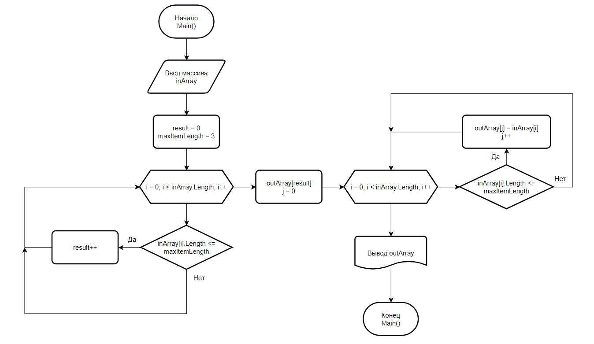

# Контрольная работа

Целью данной работы является демонстрация того, что студент [GeekBrains](https://gb.ru/) по окончании первой четверти в полной мере изучил основы программирования.

Программа представляет собой консольное .NET-приложение, функцией которого является создание одномерного массива на основании входного массива, содержащего элементы с длиной меньшей или равной трём.

Блок-схема алгоритма представлена на следующем рисунке:

Программа написана на языке C#. Версия используемого в проекте SDK - **6.0**.

> Следует отметить, что в техническом задании было указано условие, что студент не должен использовать в работе коллекции. Однако, изначально на вход программе дается массив строк. Как известно, строка является коллекцией типа System.Char, будучи **StringObject**. Для соблюдения ТЗ в полной мере, я решил пожертвовать производительностью, произведя двойной обход циклом массива вместо работы со строками. Исключением является лишь обращение к свойству Length объекта String.

Кроме того, в процессе работы над проектом я столкнулся с ошибкой, связанной с Git - ***CS0579***. На данный момент существует workaround для решения этой проблемы.

Код в полной мере декомпозирован, разбит на классы и методы в соответствии с классическими правилами ООП. К методам прилагаются подробные описания в формате XML. Соблюдение правил комментирования позволит упростить работу по созданию автодокументации.

В качестве VCS выступил Git - самая популярная на данный момент система контроля версий. Каждый этап работы был зафиксирован коммитами.